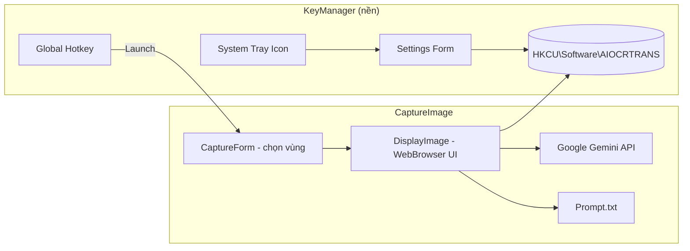

# AIOCRTRANS — AI Screen Capture, OCR & Translation

Ứng dụng Windows cho phép chụp vùng màn hình bằng phím tắt, sau đó dùng Google Gemini AI để nhận dạng văn bản (OCR), dịch sang **tiếng Anh** và **tiếng Việt**, hiển thị kết quả dạng HTML với nút Copy từng phần.

Solution gồm **2 project WinForms** (.NET Framework 4.6.2), build ra thư mục `Shared\`:

| Executable | Vai trò |
|------------|---------|
| `KeyManager.exe` | Chạy nền, đăng ký hotkey, mở Settings, khởi động cùng Windows |
| `CaptureImage.exe` | Chụp màn hình, hiển thị ảnh, gọi AI OCR/dịch |

---

## Mục đích dự án

- Cung cấp công cụ **chụp màn hình nhanh** (giống Snipping Tool) kích hoạt bằng phím tắt toàn cục.
- **Trích xuất văn bản** từ ảnh chụp bằng mô hình Google Gemini (multimodal).
- **Dịch và hiệu đính** nội dung sang tiếng Anh / tiếng Việt theo prompt trong `Prompt.txt`.
- Phù hợp cho workflow đọc tài liệu, screenshot UI, nội dung nước ngoài cần dịch nhanh mà không cần mở trình duyệt.

---

## Kiến trúc tổng quan



### Luồng sử dụng

1. `KeyManager.exe` chạy nền (icon ở system tray, ẩn khỏi taskbar / Alt+Tab / Win+Tab).
2. Người dùng bấm **phím tắt** (mặc định `Alt+X`).
3. `KeyManager` kill instance `CaptureImage` cũ (nếu có) và launch `CaptureImage.exe`.
4. `CaptureForm` phủ toàn màn hình mờ → kéo chọn vùng → chụp pixel.
5. `DisplayImage` hiển thị ảnh + nút **Convert to Text**.
6. Ảnh gửi lên Gemini kèm prompt → HTML kết quả render trong `WebBrowser`.
7. JavaScript gọi `window.external` (COM bridge) để copy text hoặc trigger OCR.

---

## Cấu trúc source code

```
LangTranslation/
├── CaptureImage.sln          # Solution Visual Studio
├── README.md
├── Shared/                   # Output build (gitignored)
│   ├── KeyManager.exe
│   ├── CaptureImage.exe
│   ├── CaptureImage.exe.config
│   └── Prompt.txt
│
├── KeyManager/               # App chạy nền + hotkey + settings
│   ├── Program.cs            # Entry point
│   ├── frmKeyManager.cs      # Form ẩn, tray icon, hotkey, startup registry
│   ├── frmSettings.cs        # UI cấu hình shortcut / API key / model
│   ├── AiOcrSettings.cs      # Load/Save Registry
│   └── KeyManager.csproj
│
└── CaptureImage/             # App chụp màn hình + OCR AI
    ├── Program.cs              # Entry → CaptureForm
    ├── frmCapture.cs           # CaptureForm — overlay chọn vùng màn hình
    ├── DisplayImage.cs         # Form kết quả, WebBrowser, ScriptingBridge, gọi Gemini
    ├── AiOcrSettings.cs        # Copy class đọc Registry (cùng logic KeyManager)
    ├── Prompt.txt              # Prompt AI (copy ra output khi build)
    ├── App.config              # Legacy Azure keys (không dùng cho Google AI)
    ├── CaptureOutput.cs        # Placeholder / legacy (trống)
    └── CaptureImage.csproj
```

### Mô tả file quan trọng

| File | Mô tả |
|------|--------|
| `frmKeyManager.cs` | `RegisterHotKey` / `UnregisterHotKey` (user32), `NotifyIcon`, menu tray (Help, Settings, Exit), tự thêm vào Windows Startup (`HKCU\...\Run`). Dùng `WS_EX_TOOLWINDOW` để ẩn khỏi task switcher. |
| `frmSettings.cs` | Form Settings: ghi shortcut, Google API key, tên model AI vào Registry. |
| `AiOcrSettings.cs` | Class config dùng chung (copy ở 2 project). Path: `HKCU\Software\AIOCRTRANS`. |
| `frmCapture.cs` | Form fullscreen trong suốt, vẽ vùng chọn, `CopyFromScreen` → Bitmap. |
| `DisplayImage.cs` | UI HTML nhúng ảnh base64; `ScriptingBridge` (ComVisible) cho JS ↔ C#; `ProcessOcrRequest` gọi Gemini; form kéo thả, double-click đóng. |
| `Prompt.txt` | Hướng dẫn AI trả về HTML có section Original / English / Vietnamese và nút Copy. |

---

## Công nghệ sử dụng

| Thành phần | Chi tiết |
|------------|----------|
| **Runtime** | .NET Framework **4.6.2** |
| **UI** | Windows Forms (WinForms) |
| **AI / OCR** | [Google_GenerativeAI](https://www.nuget.org/packages/Google_GenerativeAI) **3.0.0** — Gemini multimodal |
| **JSON** | Newtonsoft.Json **13.0.4-beta1** |
| **Web UI trong app** | `WebBrowser` control (IE engine) + HTML/CSS/JS |
| **Interop** | P/Invoke `user32.dll` (hotkey, SetWindowPos, window styles) |
| **Cấu hình** | Windows Registry `HKCU\Software\AIOCRTRANS` |
| **Legacy (không dùng chính)** | Azure Computer Vision OCR trong `GetOcrHtmlContentAsync` — cần key trong `App.config` nếu bật lại |

### Model AI mặc định

`models/gemini-2.5-flash` — có thể đổi trong Settings (ví dụ: `gemini-2.0-flash`, `gemini-1.5-pro`).

---

## Yêu cầu hệ thống & công cụ

### Hệ điều hành

- **Windows 10 / 11** (64-bit khuyến nghị)
- Quyền ghi Registry `HKEY_CURRENT_USER` (không cần admin)

### Công cụ phát triển

| Tool | Phiên bản gợi ý |
|------|------------------|
| **Visual Studio** | 2017 trở lên (solution format VS 15) — khuyến nghị VS 2019/2022 |
| **Workload** | .NET desktop development |
| **.NET Framework** | 4.6.2 Developer Pack trở lên |
| **NuGet** | Restore packages khi build (tự động qua VS/MSBuild) |

### Tài khoản / API

- **Google AI API Key** có quyền gọi Gemini (lấy tại [Google AI Studio](https://aistudio.google.com/apikey))
- Kết nối Internet khi bấm **Convert to Text**

---

## Cấu hình

### Registry (nguồn chính)

Tất cả setting người dùng lưu tại:

```
HKEY_CURRENT_USER\Software\AIOCRTRANS
```

| Value | Kiểu | Mô tả | Mặc định |
|-------|------|--------|----------|
| `HotkeyModifiers` | DWORD | Modifier flags (Ctrl=2, Alt=1, Shift=4, Win=8) | `1` (Alt) |
| `HotkeyKey` | DWORD | Virtual key code | `88` (Keys.X) |
| `GoogleApiKey` | REG_SZ | Google Gemini API key | *(rỗng)* |
| `AiModel` | REG_SZ | Tên model | `models/gemini-2.5-flash` |

> **Lưu ý:** Dùng `Registry.CurrentUser` — path là `HKCU\Software\AIOCRTRANS`, **không** bị redirect sang `Wow6432Node` vì đây là HKCU.

### Cấu hình qua UI (khuyến nghị)

1. Chạy `KeyManager.exe`
2. Click phải icon system tray → **Settings**
3. Điền **Google API key**, chọn **AI model**, đặt **Shortcut key** → **Save**

### App.config (CaptureImage)

File `CaptureImage\App.config` chỉ còn placeholder cho Azure OCR (legacy). **Google API key không còn đọc từ đây** — cấu hình qua Settings / Registry.

---

## Build

### Visual Studio

1. Mở `CaptureImage.sln`
2. Chọn configuration: **Debug** hoặc **Release**
3. Menu **Build → Build Solution** (`Ctrl+Shift+B`)
4. Output:

```
Shared\
├── KeyManager.exe
├── CaptureImage.exe
├── CaptureImage.exe.config
├── Prompt.txt
└── *.dll (dependencies)
```

### MSBuild (command line)

```powershell
# Đóng KeyManager/CaptureImage nếu đang chạy (tránh lock file exe)

& "${env:ProgramFiles}\Microsoft Visual Studio\2022\Professional\MSBuild\Current\Bin\MSBuild.exe" `
  CaptureImage.sln /p:Configuration=Release /v:minimal
```

Điều chỉnh đường dẫn MSBuild theo bản Visual Studio đã cài (`vswhere` hoặc Developer Command Prompt).

### Lưu ý khi build

- Thư mục `Shared\` nằm trong `.gitignore` — cần build local để có executable.
- **KeyManager phải thoát** trước khi build, nếu không MSBuild báo lỗi copy file (`file is being used by another process`).
- NuGet packages restore tự động khi build trong Visual Studio.

---

## Chạy ứng dụng

### Lần đầu

1. Build solution (hoặc copy bộ file vào cùng một thư mục, ví dụ `Shared\`).
2. Chạy **`KeyManager.exe`** (app chính, chạy nền).
3. Mở **Settings** từ tray → nhập **Google API key** → Save.
4. (Tuỳ chọn) Đặt `UserManual.html` cùng thư mục để menu **Help** hoạt động.

### Sử dụng hàng ngày

| Thao tác | Cách thực hiện |
|----------|----------------|
| Chụp màn hình | Phím tắt (mặc định `Alt+X`) |
| Chọn vùng | Kéo chuột trái trên overlay |
| Huỷ chụp | `Esc` hoặc click không chọn vùng |
| OCR + dịch | **Convert to Text** trong cửa sổ kết quả |
| Copy từng đoạn | Nút **Copy** trên từng section HTML |
| Đóng cửa sổ kết quả | Double-click form hoặc đóng form |
| Cài đặt | Tray → Settings |
| Thoát app nền | Tray → Exit |

### Startup cùng Windows

`KeyManager` tự đăng ký startup tại:

```
HKCU\Software\Microsoft\Windows\CurrentVersion\Run
```

và bật approved flag trong `StartupApproved\Run`.

---

## Chi tiết kỹ thuật

### Global hotkey

- Đăng ký qua Win32 `RegisterHotKey` trên handle form ẩn của KeyManager.
- Khi đổi shortcut trong Settings: `UnregisterHotKey` → `RegisterHotKey` với giá trị mới.
- Nếu phím đã bị app khác chiếm → balloon tip cảnh báo.

### Bridge JavaScript ↔ C#

Class `ScriptingBridge` (`ComVisible = true`) expose:

- `PerformOcr()` — gọi `ProcessOcrRequest()`
- `CopyToClipboard(text)` — copy vào clipboard Windows

Gán qua `webBrowser1.ObjectForScripting`.

### Xử lý ảnh

- Ảnh chụp giữ trong field `_capturedImage` suốt vòng đời form.
- **Không** dispose `_capturedImage` sau mỗi lần OCR (tránh lỗi `Parameter is not valid` khi Convert lần 2).
- Dispose `_capturedImage` khi đóng form (`DisplayImage.Dispose`).

### Ẩn KeyManager khỏi taskbar / Alt+Tab

- `ShowInTaskbar = false`
- Extended style `WS_EX_TOOLWINDOW`, bỏ `WS_EX_APPWINDOW`
- Form đặt ngoài màn hình `(-2000, -2000)`

---

## Troubleshooting

| Vấn đề | Nguyên nhân / Cách xử lý |
|--------|---------------------------|
| Convert to Text lỗi lần 2 | Đã fix: không dispose `_capturedImage` sớm. Rebuild CaptureImage mới nhất. |
| `Parameter is not valid` khi Save PNG | Bitmap đã bị dispose — kiểm tra bản DisplayImage.cs mới. |
| Không có API key | Mở KeyManager → Settings → nhập Google API key. |
| Hotkey không hoạt động | Phím bị app khác dùng; đổi shortcut trong Settings. |
| Build lỗi copy exe | Thoát KeyManager/CaptureImage đang chạy. |
| Không thấy icon tray | Kiểm tra mũi tên ^ (hidden icons) trên taskbar. |
| AI trả về lỗi | Kiểm tra API key, model name, kết nối mạng; xem message trong panel kết quả. |
| WebBrowser hiển thị lạ | Control dùng IE engine; HTML/CSS nên tương thích IE/Edge legacy mode (`X-UA-Compatible: IE=Edge`). |

---

## Phát triển thêm

- **Đồng bộ `AiOcrSettings.cs`:** Class được copy ở 2 project — khi sửa phải cập nhật cả hai file.
- **Prompt:** Sửa `CaptureImage\Prompt.txt` → rebuild; file được copy `Always` ra output.
- **Azure OCR:** Method `GetOcrHtmlContentAsync` vẫn trong code nhưng không được gọi; có thể bật lại bằng cách đổi trong `ProcessOcrRequest`.
- **Icon tray:** Hiện dùng `SystemIcons.Hand` — có thể thay bằng `.ico` riêng.

---

## License & liên hệ

Copyright © 2025. Thông tin license và maintainer — cập nhật theo chính sách nội bộ của team.
